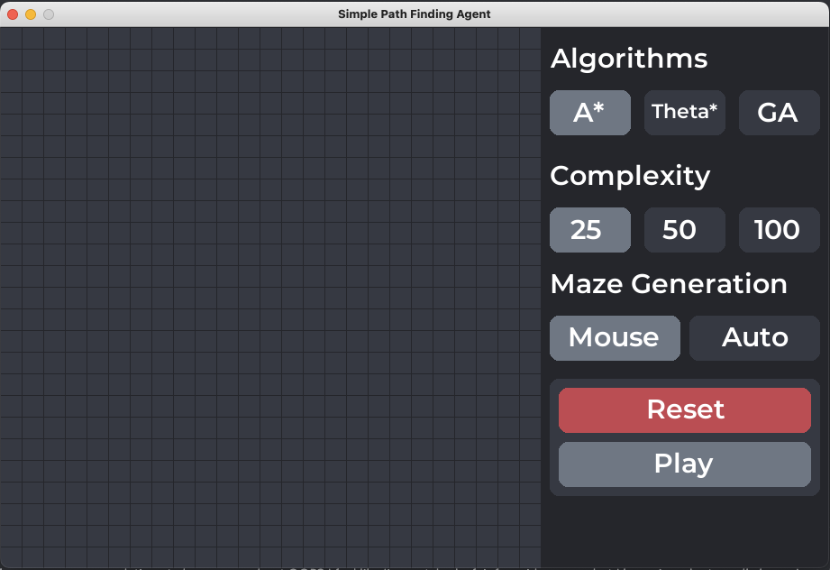
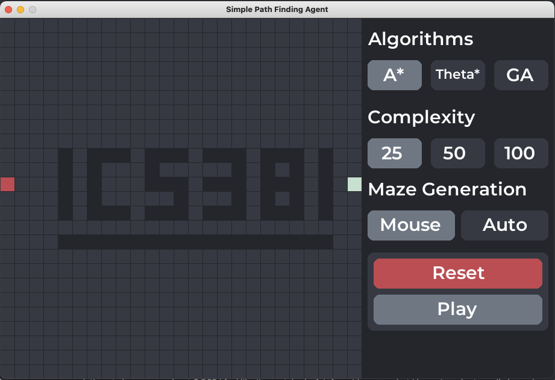
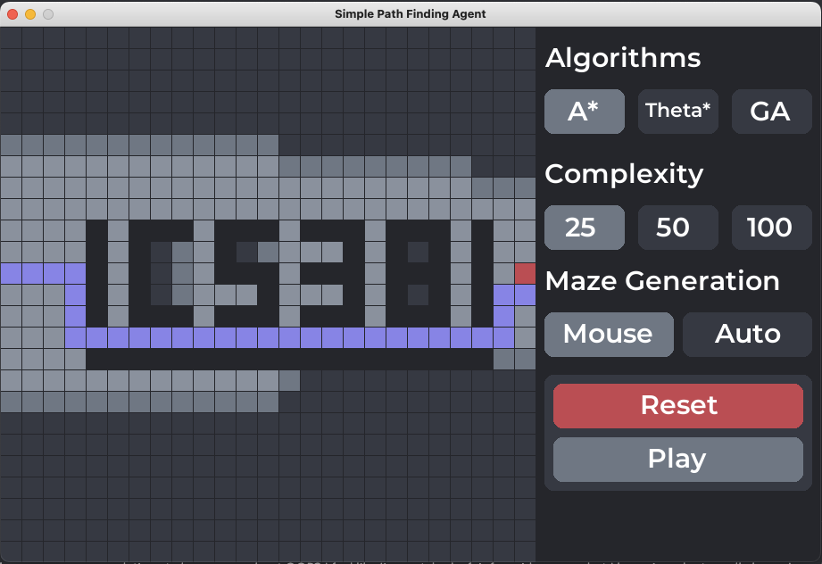

# PA1-II Group 104

## Authors:
####Omar Alghamdi   201855000
####Faisal Alali    201815380

## Added or Changed
- Added this readme file :)
- Fixed bugs in both codes.
- Added theta* algorithm.
- Improved the maze generation algorithm (work in progress).
- Included assets to improve the GUI.

## Instructions:

0- Run the python code using the `Run` button.

1- Select the desired algorithm from the three options under **Algorithms** menu:
- `A* Algorithm`
- `Theta* Algorithm`
- `Genetic Algorithm (NOT IMPLEMENTED YET)`

2- Select the canvas size under the **Complexity** menu:
- `25` 25 x 25 grid size.
- `50` 50 x 50 grid size.
- `100` 100 x 100 grid size.

3- The maze could be generated in the **Maze Generation** menu by either constructed manually using the `mouse` option, or automatically using the `Auto` option.
`mouse`: Use the mouse left-button to start drawing the maze, the first element would be the starting point with the dark gray color.
The second point is the end point, indicated with the color Turquoise.
Finally, the boarder lines will be colored with Black.

4- Generating the maze automatically using the `Auto` mode will create a random maze with all reachable areas.

5- After choosing the algorithm, use the `Play` button to start the path finding
- Dark gray areas indicates areas that are not discovered.
- Gray areas indicates areas than will be discovered.
- Light gray areas indicate areas that have been already discovered.
- Purple areas indicates the path.

##Board elements

###Board elements before search

###Board elements after search

- ###Board elements
  - Start node (Red square)
  - End node (light green square)
  - Barrier node (Black square)
  - Path node (Purple square)
  - Discovered node (Light gray square)
  - To be discovered (gray square)
  - Undiscovered node (Dark gray square)
  

- ###Control elements
  - A* (A* algorithm selection)
  - Theta* (Theta* algorithm selection)
  - Genetic Algorithm (Genetic Algorithm selection)
  - 25 (25 x 25 size selection)
  - 50 (50 x 50 size selection)
  - 100 (100 x 100 size selection)
  - Mouse (Mouse maze generation selection)
  - Auto (Auto maze generation selection)
  - play (start searching selection)
  - Reset (reconstruct the board).

## References
1- [Theta* algorithm article](https://arxiv.org/pdf/1401.3843.pdf)

2- [Genetic algorithm video](https://www.youtube.com/watch?v=uCXm6avugCo)
